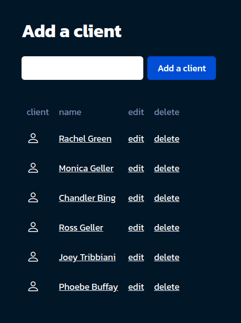

Flask CRUD application with JSON
================================

## Description

CRUD (Create, Read, Update and Delete) application with Flask framework, storing the data in a JSON file.

## Demo

*Author [Maor Tzabari](https://oritzio.com/)*